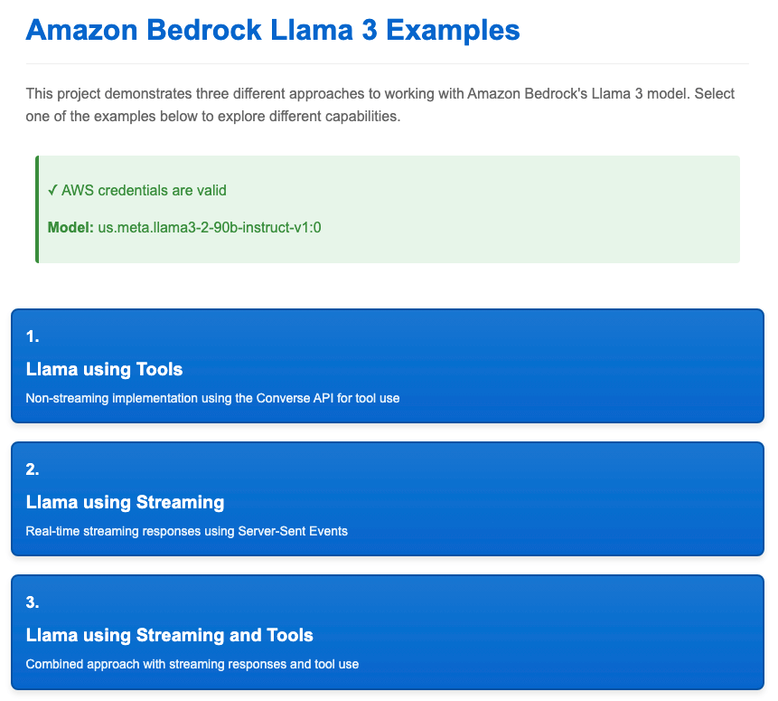
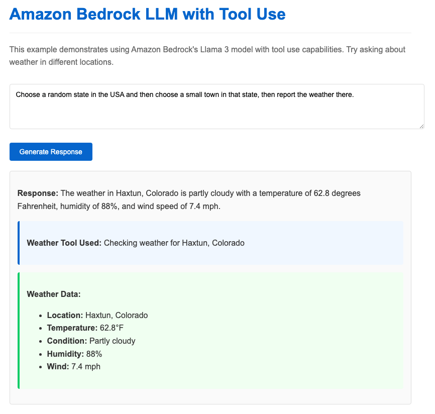
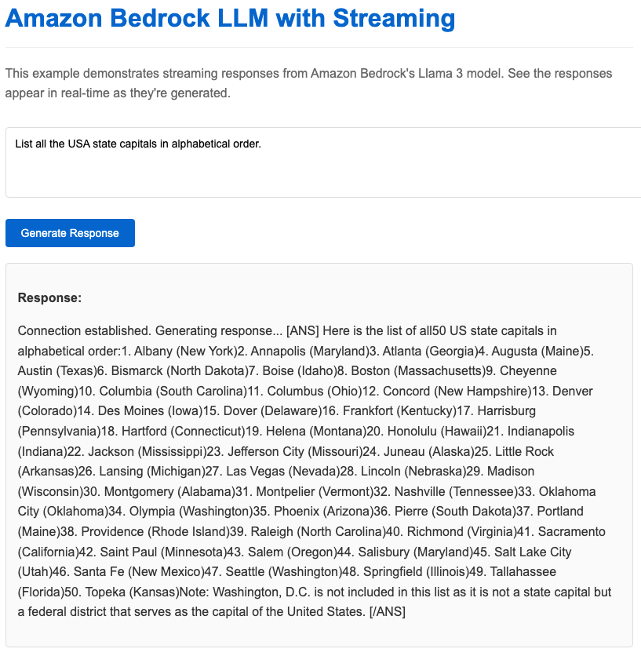
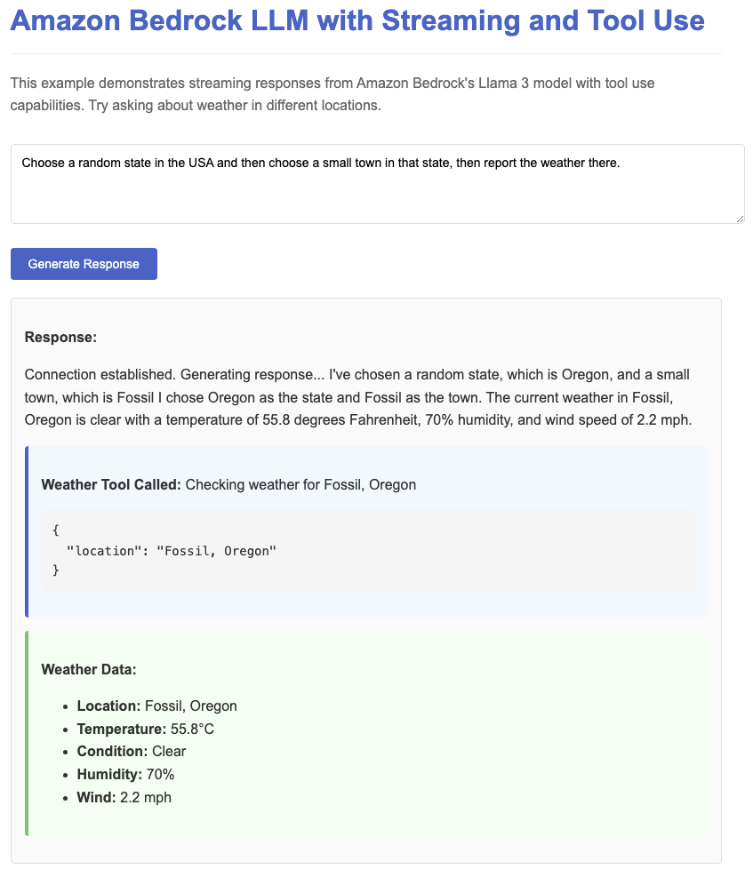

# Amazon Bedrock LLM Examples with Streaming and Tool Use

This project demonstrates three different approaches to working with Amazon Bedrock's Llama 3 model, showcasing streaming responses and tool use capabilities using Node.js, Express, and Server-Sent Events (SSE).

**IMPORTANT: Educational Demonstration Only**

This is a **demonstration application for educational purposes only** and is **not intended for production deployment**. The application is designed to run locally (localhost) to showcase streaming and tool integration concepts in a controlled environment.

**Security Considerations for Production Use:**

If you plan to adapt this code for production use, you must implement additional security controls including but not limited to:

- **Authentication & Authorization**: Implement proper user authentication (e.g., AWS Cognito, OAuth 2.0) and role-based access controls
- **Input Validation & Sanitization**: Add comprehensive input validation and output sanitization to prevent injection attacks
- **Prompt Injection Protection**: Implement prompt hardening techniques and input filtering to prevent prompt injection and jailbreak attempts
- **Amazon Bedrock Guardrails**: Configure content filtering, topic restrictions, and PII detection using Bedrock Guardrails
- **Rate Limiting**: Implement API rate limiting and request throttling to prevent abuse
- **HTTPS/TLS**: Use HTTPS for all communications in production environments
- **Network Security**: Implement proper network segmentation, firewalls, and access controls
- **Monitoring & Logging**: Add comprehensive security monitoring, audit logging, and alerting
- **Credential Management**: Use secure credential storage (AWS Secrets Manager, Parameter Store) instead of configuration files
- **Error Handling**: Implement secure error handling that doesn't expose sensitive information

**Current Security Posture:**

This demonstration application uses a localhost-only deployment model with minimal security controls appropriate for educational purposes. It assumes a single user in a controlled local environment and should not be exposed to public networks or used with production data.

## Key Features

- **Three Implementation Examples**:
  1. **Tool Use with Converse API**: Demonstrates non-streaming tool use with the Bedrock Converse API
  2. **Simple Streaming**: Shows real-time text generation with Server-Sent Events
  3. **Streaming with Tool Use via Sentinel Phrases**: Combines streaming with tool use through a novel sentinel phrase technique

- **Real-time Streaming**: Implements Server-Sent Events (SSE) for streaming LLM responses as they're generated
- **Tool Use Integration**: Demonstrates how to implement and handle tool use with Llama 3
- **Weather API Integration**: Includes a working example of a weather tool that provides real data
- **Clean Frontend UI**: Simple interface for interacting with the model and visualizing results

## Prerequisites

1. AWS Account with access to Amazon Bedrock
2. AWS credentials with appropriate permissions for Bedrock
3. Access to the Meta Llama 3 model in Amazon Bedrock
4. Node.js installed (v14 or later recommended)
5. **Weather API Key** from [WeatherAPI.com](https://www.weatherapi.com/) (free tier available)

## Setup

### 1. Install Dependencies

```bash
npm install
```

### 2. Configure AWS Credentials

Ensure your AWS credentials are configured in `~/.aws/credentials` with a `default` profile:

```
[default]
aws_access_key_id = YOUR_ACCESS_KEY
aws_secret_access_key = YOUR_SECRET_KEY
region = us-east-1
```

### 3. Configure Weather API Key

1. Sign up for a free API key at [WeatherAPI.com](https://www.weatherapi.com/)
2. Copy `config.example.js` to `config.js` in the project root
3. Edit `config.js` and replace `YOUR_WEATHER_API_KEY` with your actual API key:

```javascript
weatherApi: {
    apiKey: "YOUR_ACTUAL_API_KEY_HERE",
    baseUrl: "https://api.weatherapi.com/v1"
},
```

### 4. Running the Application

1. Start the server:
   ```bash
   npm start
   ```

2. Access the application at `http://localhost:3000`

## Technical Implementation Details

### Example 1: Tool Use with Converse API

This example demonstrates how to use the [Bedrock Converse API](https://docs.aws.amazon.com/bedrock/latest/userguide/conversation-inference.html) to implement tool use with Llama 3.

#### Key Technical Components:

1. **Converse API**: Uses the AWS SDK's `ConverseCommand` to enable tool use
   - [AWS Converse API Documentation](https://docs.aws.amazon.com/bedrock/latest/userguide/conversation-inference.html)

2. **Multi-Turn Conversation Flow**:
   - First request defines the tool and sends the user prompt
   - Model responds with a tool use request if needed
   - Tool is executed to get real data
   - Second request includes the tool result for the model to complete its response

3. **Tool Definition Schema**:
   ```javascript
   const toolConfig = {
     tools: [{
       toolSpec: {
         name: "weather",
         description: "Get current weather information for a location",
         inputSchema: {
           json: {
             type: "object",
             properties: { 
               location: { type: "string", description: "The city and state/country" },
               unit: { type: "string", enum: ["celsius", "fahrenheit"] }
             },
             required: ["location"]
           }
         }
       }
     }]
   };
   ```

4. **Tool Result Format**:
   ```javascript
   {
     role: "user",
     content: [{
       toolResult: {
         toolUseId,
         content: [{ json: weatherData }]
       }
     }]
   }
   ```

### Example 2: Simple Streaming

This example shows how to implement streaming responses from Llama 3 using Server-Sent Events (SSE).

#### Key Technical Components:

1. **InvokeModelWithResponseStreamCommand**: Uses the streaming version of the Bedrock API
   - [AWS Streaming API Documentation](https://docs.aws.amazon.com/bedrock/latest/userguide/model-parameters.html#model-parameters-streaming)

2. **Server-Sent Events (SSE) Protocol**: Sets up a one-way communication channel from server to client
   ```javascript
   // Server-side setup
   res.setHeader('Content-Type', 'text/event-stream');
   res.setHeader('Cache-Control', 'no-cache');
   res.setHeader('Connection', 'keep-alive');
   ```

3. **Binary Chunk Processing**: Decodes and processes binary chunks from the Bedrock stream
   ```javascript
   const textDecoder = new TextDecoder('utf-8');
   const chunkText = textDecoder.decode(chunk.chunk.bytes);
   const parsedChunk = JSON.parse(chunkText);
   sendSSEMessage(res, { text: parsedChunk.generation });
   ```

4. **EventSource API**: Client-side API for receiving server-sent events
   ```javascript
   // Client-side
   const eventSource = new EventSource(`/api/generate/stream?prompt=${encodeURIComponent(prompt)}`);
   eventSource.onmessage = (event) => {
     const data = JSON.parse(event.data);
     // Process the data
   };
   ```

### Example 3: Streaming with Tool Use via Sentinel Phrases

This example demonstrates a novel technique that combines streaming with tool use through sentinel phrases, enabling a capability that is [not officially supported](https://docs.aws.amazon.com/bedrock/latest/userguide/conversation-inference-supported-models-features.html) for Llama 3 models.

#### Key Technical Components:

1. **Sentinel Phrase Technique**: Uses special markers in the system prompt to instruct the model to emit specific patterns when it wants to use a tool
   ```
   <CALL_WEATHER>{"location":"San Francisco, CA"}</CALL_WEATHER>
   ```

2. **System Prompt Engineering**: Carefully crafted system prompt that teaches the model to use sentinel phrases
   ```javascript
   const systemPrompt = 
     `You are a helpful assistant that can check the weather. When the user asks about weather in a location, 
     respond ONLY with ${WEATHER_SENTINEL_START}{"location":"CITY_NAME, STATE_NAME"}${WEATHER_SENTINEL_END} inside the USA 
     or ${WEATHER_SENTINEL_START}{"location":"CITY_NAME, REGION_NAME"}${WEATHER_SENTINEL_END} outside of the USA and wait for the result.
     When you receive weather data in the format ${WEATHER_RESULT_START}{...}${WEATHER_RESULT_END}, use that data to answer the user's question.`;
   ```

3. **Stream Buffer Analysis**: Continuously analyzes the streaming text buffer to detect sentinel phrases
   ```javascript
   function checkForSentinelPhrases(buffer) {
     // Look for a complete tool call: <CALL_WEATHER>...payload...</CALL_WEATHER>
     const startIndex = buffer.indexOf(WEATHER_SENTINEL_START);
     if (startIndex !== -1) {
       const endIndex = buffer.indexOf(
         WEATHER_SENTINEL_END,
         startIndex + WEATHER_SENTINEL_START.length
       );
       
       if (endIndex !== -1) {
         // Extract and parse the JSON payload between the sentinel tags
         // ...
       }
     }
     // ...
   }
   ```

4. **Multi-Stage Streaming Process**:
   - First stream: Send prompt with system instructions and detect tool call
   - Execute tool when sentinel phrase is detected
   - Second stream: Send prompt with tool results and stream the final response

5. **Safe Text Emission**: Carefully manages the text buffer to ensure sentinel phrases are not sent to the client
   ```javascript
   // No sentinel start tag found - emit text except for a safety buffer
   if (buffer.length > MAX_SENTINEL_LENGTH) {
     const safeLength = buffer.length - MAX_SENTINEL_LENGTH;
     return {
       emitted: buffer.slice(0, safeLength),
       buffer: buffer.slice(safeLength),
       match: null
     };
   }
   ```

## Server-Sent Events (SSE) Implementation

All streaming examples use Server-Sent Events (SSE) to deliver real-time content to the client. Key aspects of the SSE implementation include:

1. **Connection Setup**: Configures response headers for SSE
   ```javascript
   function setupSSEConnection(res) {
     res.setHeader('Content-Type', 'text/event-stream');
     res.setHeader('Cache-Control', 'no-cache');
     res.setHeader('Connection', 'keep-alive');
     // Send initial connection message
     sendSSEMessage(res, { text: "Connection established. Generating response..." });
   }
   ```

2. **Message Format**: Sends JSON data in the SSE format
   ```javascript
   function sendSSEMessage(res, data) {
     res.write(`data: ${JSON.stringify(data)}\n\n`);
   }
   ```

3. **Event Types**: Different message types for different content
   - Regular text: `{ text: "content here" }`
   - Tool calls: `{ toolCall: "weather", toolArgs: "{...}" }`
   - Tool responses: `{ toolResponse: {...} }`
   - Completion: `{ done: true }`

4. **Error Handling**: Sends error messages through the same channel
   ```javascript
   sendSSEMessage(res, { error: 'Failed to generate response: ' + error.message });
   ```

## Why Sentinel Phrases Matter

The sentinel phrase technique demonstrated in Example 3 is particularly significant because:

1. **Overcoming Platform Limitations**: According to [AWS documentation](https://docs.aws.amazon.com/bedrock/latest/userguide/conversation-inference-supported-models-features.html), streaming with tools is not officially supported for Llama 3 models. This technique provides a workaround.

2. **Real-time Tool Use**: Enables tools to be used in a streaming context, providing a more responsive user experience compared to non-streaming approaches.

3. **Flexible Implementation**: Can be adapted to work with any LLM that can follow instructions about output formatting, not just those with built-in tool use capabilities.

4. **Prompt Engineering Showcase**: Demonstrates how careful prompt engineering can extend model capabilities beyond their default behavior.

## Project Structure

```
.
├── docs/                      # Example screenshots and documentation
├── public/                    # Frontend static files
│   ├── index.html             # Main menu
│   ├── tools.html             # Example 1: Tool Use with Converse API
│   ├── streaming.html         # Example 2: Simple Streaming
│   ├── streaming-and-tools.html # Example 3: Streaming with Tool Use
│   └── styles.css             # Shared styles
├── config.js                  # Configuration settings including API keys
├── server.js                  # Backend Express server with all endpoints
└── package.json               # Project dependencies and scripts
```

## API Endpoints

1. **`/api/generate/tools`** (POST): Non-streaming endpoint using Converse API for tool use
2. **`/api/generate/stream`** (GET): Streaming endpoint using SSE for real-time responses
3. **`/api/generate/stream-tools`** (GET): Streaming endpoint with tool use via sentinel phrases
4. **`/api/check-credentials`** (GET): Validates AWS credentials and returns model information
5. **`/api/health`** (GET): Simple health check endpoint

## Learning Points

1. **AWS Bedrock Integration**: How to use the AWS SDK v3 with Bedrock for different types of requests
   - [AWS Bedrock Developer Guide](https://docs.aws.amazon.com/bedrock/latest/userguide/what-is-bedrock.html)
   - [AWS SDK for JavaScript v3](https://docs.aws.amazon.com/AWSJavaScriptSDK/v3/latest/client/bedrock-runtime/)

2. **Streaming Response Patterns**: Implementation of server-sent events for real-time responses
   - [MDN Server-Sent Events Guide](https://developer.mozilla.org/en-US/docs/Web/API/Server-sent_events/Using_server-sent_events)

3. **Tool Use Approaches**: Two different approaches to implementing tool use
   - Official Converse API with explicit tool definitions
   - Sentinel phrase technique for streaming contexts
   - [AWS Tool Use Documentation](https://docs.aws.amazon.com/bedrock/latest/userguide/tool-use.html)

4. **Prompt Engineering**: How to craft effective system prompts that guide model behavior
   - [AWS Prompt Engineering Guide](https://docs.aws.amazon.com/bedrock/latest/userguide/prompt-engineering.html)

5. **Error Handling**: Proper error handling for API calls and streaming connections

## Security Considerations

- AWS credentials are stored securely and never exposed to the client
- All AWS operations are handled by the backend server
- Input validation is performed on all user inputs
- Error handling prevents sensitive information leakage
- API keys are stored in a separate configuration file that should not be committed to version control

## Troubleshooting

1. **AWS Credentials**: Ensure your credentials have Bedrock permissions and are correctly configured
   - [AWS Credentials Configuration](https://docs.aws.amazon.com/cli/latest/userguide/cli-configure-files.html)

2. **Model Access**: Verify you have access to the Meta Llama 3 model in your AWS account
   - [Bedrock Model Access](https://docs.aws.amazon.com/bedrock/latest/userguide/model-access.html)

3. **Weather API Key**: If you see weather tool errors, verify your API key is correctly configured in `config.js`

4. **Connection Issues**: Check for network issues if the stream fails to establish

5. **Tool Use Issues**: 
   - For the Converse API, ensure you include the `toolConfig` in both requests
   - For sentinel phrases, check that the system prompt correctly defines the sentinel format

## Further Learning Resources

- [Amazon Bedrock Documentation](https://docs.aws.amazon.com/bedrock/)
- [Bedrock Converse API](https://docs.aws.amazon.com/bedrock/latest/userguide/conversation-inference.html)
- [Bedrock Streaming](https://docs.aws.amazon.com/bedrock/latest/userguide/model-parameters.html#model-parameters-streaming)
- [Bedrock Tool Use](https://docs.aws.amazon.com/bedrock/latest/userguide/tool-use.html)
- [Server-Sent Events MDN Documentation](https://developer.mozilla.org/en-US/docs/Web/API/Server-sent_events)
- [AWS SDK for JavaScript v3](https://docs.aws.amazon.com/AWSJavaScriptSDK/v3/latest/)
- [Express.js Documentation](https://expressjs.com/)

## Example Screenshots








